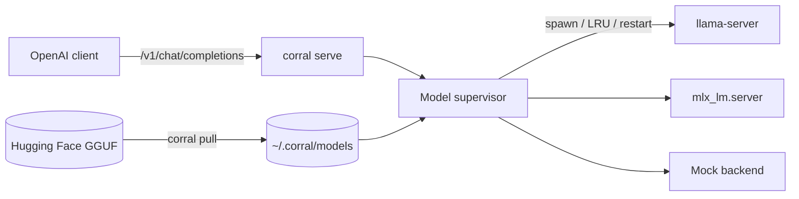

# Corral

[English](README.md) | [中文](README.zh.md) | [日本語](README.ja.md)

[](LICENSE) [](CHANGELOG.md) [](https://nodejs.org)  [](CONTRIBUTING.md)

**オープンソースの no-fork なローカルモデルランナー。自分の llama.cpp と MLX を、OpenAI 互換 API の背後で動かします。**


```bash
git clone https://github.com/JaydenCJ/corral.git && cd corral && npm install && npm run build && npm link
```

> **プレリリース:** Corral はまだ npm に公開されていません。最初のリリースまでは、[JaydenCJ/corral](https://github.com/JaydenCJ/corral) を clone してリポジトリ直下で `npm install && npm run build && npm link` を実行してください。

## なぜ Corral なのか

ローカルモデルを動かす今の選択肢は、private な llama.cpp の fork と独自 registry を抱えた便利なツールか、`llama-server` と `llama-swap` を手作業で組み合わせるか、ほぼ二択です。Corral は中間の道を取ります。薄い orchestrator として、自分でインストールした upstream のバイナリを起動し、Hugging Face から素の GGUF を取得し、OpenAI の API を話します。何も fork せず、registry も作りません。

|  | Corral | Ollama | llama.cpp + llama-swap |
|---|---|---|---|
| Forks / vendors llama.cpp | No (runs your binary) | Yes (vendored fork) | No (is llama.cpp) |
| Model source | Any Hugging Face GGUF | Ollama registry | Any GGUF (manual) |
| Hot model swapping | Yes | Yes | Yes (via llama-swap) |
| OpenAI-compatible API | Yes | Yes | Yes |
| Backends | llama.cpp + MLX | Bundled fork | llama.cpp |
| Single integrated tool | Yes | Yes | No (assemble yourself) |

## Corral の立場

Corral は、閉じたローカルモデルツールへの根強い不満に、一つずつ答えます。

- **llama.cpp を fork しない** — Corral は自分でインストールした `llama-server` バイナリを起動します。古くなっていく patch 版のコピーは存在せず、llama.cpp を更新した瞬間に upstream の修正が届きます。
- **private registry なし** — モデルはディスク上の GGUF ファイルそのものです。`corral pull` は Hugging Face から直接取得し、取得元 URL を manifest に記録します。経由すべき `corral.com` はありません。
- **改善は upstream へ** — Corral は orchestration（pull・hot-swap・proxy・プロセス監視）だけを担当します。推論に関わるものは llama.cpp や MLX に属し、全員が恩恵を受けます。
- **フォーマットを固定しない** — ファイルは標準の GGUF のままです。明日 Corral を削除しても、同じファイルは任意の llama.cpp ビルドでそのまま動きます。

## 特徴

- **fork なし、ロックインなし** — 自分でインストールした upstream の `llama-server` を起動します。GGUF は完全に手元に残る素のファイルです。
- **Hugging Face から直接 pull** — `corral pull owner/repo:Q4_K_M` がファイル一覧を解決し、quant を選び、中断したダウンロードを再開します。
- **モデルの hot-swap** — 1 つのエンドポイントで複数のモデルを提供します。必要な backend をオンデマンドで起動し、残りを LRU で回収します。
- **OpenAI 互換 API** — `/v1/chat/completions`、`/v1/completions`、`/v1/models` を提供し、SSE の streaming はそのまま透過します。
- **2 つの backend** — llama.cpp は全プラットフォーム、MLX は Apple Silicon 向けで、設定または `--backend` フラグでサーバー単位に選べます。
- **自己修復** — クラッシュした backend は上限付きで再起動し、idle なモデルは回収し、Ctrl+C はすべての子プロセスを片付けます。

## クイックスタート

インストール:

```bash
git clone https://github.com/JaydenCJ/corral.git && cd corral && npm install && npm run build && npm link
```

デモを実行します。決定的な `mock` backend は llama.cpp も weights も不要です:

```bash
corral serve --backend mock --port 11435 &
curl -s localhost:11435/v1/chat/completions \
  -d '{"model":"demo","messages":[{"role":"user","content":"say hi"}]}'
```

出力:

```text
{"id":"chatcmpl-mock-demo","object":"chat.completion","created":1700000000,"model":"demo","choices":[{"index":0,"message":{"role":"assistant","content":"[demo] echo: say hi"},"finish_reason":"stop"}],"usage":{"prompt_tokens":8,"completion_tokens":19,"total_tokens":27}}
```

`mock` backend は配線全体をエンドツーエンドで確認します。実際の推論には、下記の手順で自分のモデルを接続します。

## 自分のモデルを使う

実際の推論には、手元に upstream の backend が必要です。Corral はモデルも推論エンジンも同梱しません。以下の手順はローカルの llama.cpp（macOS/Linux）とネットワークを必要とするため、上のコンテナ内でテスト済みの Quickstart には含まれません。

```bash
# 1. install upstream llama.cpp yourself (Corral vendors nothing)
brew install llama.cpp

# 2. pull a GGUF straight from Hugging Face into ~/.corral/models
corral pull TheBloke/Qwen2.5-7B-Instruct-GGUF:Q4_K_M

# 3. serve with the real backend and talk to it from any OpenAI client
corral serve --backend llamacpp
```

デフォルトは `~/.corral/config.json` にあり、各コマンドでフラグから上書きできます:

```json
{
  "backend": "llamacpp",
  "host": "127.0.0.1",
  "port": 11435,
  "maxLoaded": 1,
  "idleTimeoutMs": 300000,
  "ctxSize": 4096,
  "maxRestarts": 3
}
```

Apple Silicon では `"backend"` を `"mlx"` に設定すると（`pip install mlx-lm` が必要）MLX モデルを動かせます。任意の OpenAI SDK を `http://127.0.0.1:11435/v1` に向けてください。モデルの切り替えは `model` フィールドを変えるだけです。

## 検証

本リポジトリは CI を持たず、上記の内容はローカル実行で検証しています。本リポジトリの checkout から再現できます:

```bash
npm ci && npm run build && npm test && bash scripts/smoke.sh
```

出力（実際の実行からコピー。`...` で省略）:

```text
 Test Files  9 passed (9)
      Tests  58 passed (58)
...
[smoke] GET /v1/models -> lists loaded mock model smoke-b
[smoke] POST /v1/chat/completions (stream) -> SSE chunks + [DONE]
SMOKE OK
```

## アーキテクチャ



## ロードマップ

- [x] llama.cpp + MLX backend、Hugging Face からの pull、hot-swap、OpenAI API、mock ベースのテスト
- [ ] 分割（マルチパート）GGUF の結合
- [ ] 設定でのモデル単位の backend と quant の上書き
- [ ] Hugging Face 公開ハッシュに対する sha256 検証（任意）
- [ ] `corral serve` の Prometheus メトリクスエンドポイント
- [ ] backend バイナリの本格的な Windows 対応

全体は [open issues](https://github.com/JaydenCJ/corral/issues) を参照してください。

## コントリビューション

コントリビューションを歓迎します。まずは [good first issue](https://github.com/JaydenCJ/corral/issues?q=is%3Aissue+is%3Aopen+label%3A%22good+first+issue%22) から、または [Discussions](https://github.com/JaydenCJ/corral/discussions) でお気軽にどうぞ。

## ライセンス

[MIT](LICENSE)
