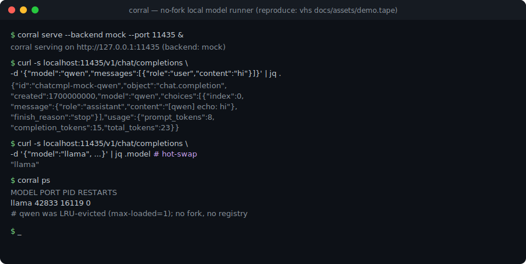
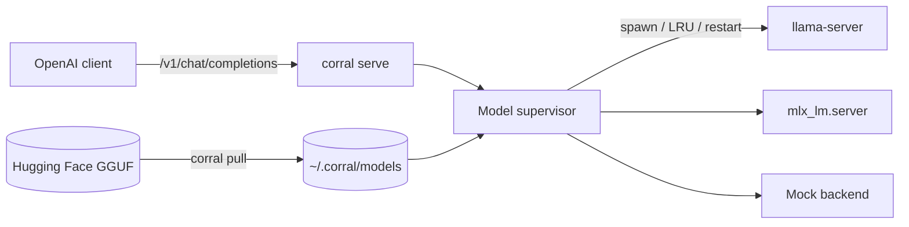

# Corral

[English](README.md) | [中文](README.zh.md) | [日本語](README.ja.md)

[](LICENSE) [](CHANGELOG.md) [](https://nodejs.org)  [](CONTRIBUTING.md)

**An open-source, no-fork local model runner that drives your own llama.cpp and MLX behind an OpenAI-compatible API.**



```bash
git clone https://github.com/JaydenCJ/corral.git && cd corral && npm install && npm run build && npm link
```

> **Pre-release:** Corral is not yet published to npm. Until the first release, clone [JaydenCJ/corral](https://github.com/JaydenCJ/corral) and run `npm install && npm run build && npm link` from the repository root.

## Why Corral?

Running local models today means choosing between a slick tool that vendors a private fork of llama.cpp with its own registry, or hand-assembling `llama-server` and `llama-swap` yourself. Corral takes the middle path: a thin orchestrator that launches the exact upstream binaries you install, pulls plain GGUF files from Hugging Face, and speaks the OpenAI API — without forking anything or inventing a registry.

|  | Corral | Ollama | llama.cpp + llama-swap |
|---|---|---|---|
| Forks / vendors llama.cpp | No (runs your binary) | Yes (vendored fork) | No (is llama.cpp) |
| Model source | Any Hugging Face GGUF | Ollama registry | Any GGUF (manual) |
| Hot model swapping | Yes | Yes | Yes (via llama-swap) |
| OpenAI-compatible API | Yes | Yes | Yes |
| Backends | llama.cpp + MLX | Bundled fork | llama.cpp |
| Single integrated tool | Yes | Yes | No (assemble yourself) |

## Where Corral stands

Corral answers the recurring community complaints about closed local-model tooling, point by point:

- **Does not fork llama.cpp** — Corral spawns the `llama-server` binary you installed. There is no patched copy to drift out of date; upstream fixes reach you the moment you update llama.cpp.
- **No private registry** — a model is just the GGUF file on your disk. `corral pull` fetches it straight from Hugging Face and records the source URL in a manifest. There is no `corral.com` to route through.
- **Improvements go upstream** — Corral deliberately owns only orchestration (pull, hot-swap, proxy, supervision). Anything about inference belongs in llama.cpp or MLX, where everyone benefits.
- **No format lock-in** — your files stay standard GGUF. Delete Corral tomorrow and the same files keep working with any llama.cpp build.

## Features

- **No fork, no lock-in** — runs the exact upstream `llama-server` you install; your GGUFs stay plain files you fully own.
- **Pull straight from Hugging Face** — `corral pull owner/repo:Q4_K_M` resolves the file list, picks your quant, and resumes interrupted downloads.
- **Hot model swapping** — one endpoint serves many models; Corral starts the right backend on demand and LRU-evicts the rest.
- **OpenAI-compatible API** — `/v1/chat/completions`, `/v1/completions`, and `/v1/models`, with SSE streaming passed through untouched.
- **Two backends** — llama.cpp everywhere, MLX on Apple Silicon, selectable per server via config or the `--backend` flag.
- **Self-healing** — crashed backends restart within a bounded budget, idle models are reaped, and Ctrl+C cleans up every child process.

## Quickstart

Install:

```bash
git clone https://github.com/JaydenCJ/corral.git && cd corral && npm install && npm run build && npm link
```

Run the demo — the deterministic `mock` backend needs no llama.cpp and no weights:

```bash
corral serve --backend mock --port 11435 &
curl -s localhost:11435/v1/chat/completions \
  -d '{"model":"demo","messages":[{"role":"user","content":"say hi"}]}'
```

Output:

```text
{"id":"chatcmpl-mock-demo","object":"chat.completion","created":1700000000,"model":"demo","choices":[{"index":0,"message":{"role":"assistant","content":"[demo] echo: say hi"},"finish_reason":"stop"}],"usage":{"prompt_tokens":8,"completion_tokens":19,"total_tokens":27}}
```

The `mock` backend proves the plumbing end to end. For real inference, plug in your own model below.

## Using your own models

Real inference needs an upstream backend on your machine — Corral bundles no models and no engine. These steps require a local llama.cpp (macOS/Linux) and network access, so they are not part of the container-tested Quickstart above.

```bash
# 1. install upstream llama.cpp yourself (Corral vendors nothing)
brew install llama.cpp

# 2. pull a GGUF straight from Hugging Face into ~/.corral/models
corral pull TheBloke/Qwen2.5-7B-Instruct-GGUF:Q4_K_M

# 3. serve with the real backend and talk to it from any OpenAI client
corral serve --backend llamacpp
```

Defaults live in `~/.corral/config.json` and are overridable per command with flags:

```json
{
  "backend": "llamacpp",
  "host": "127.0.0.1",
  "port": 11435,
  "maxLoaded": 1,
  "idleTimeoutMs": 300000,
  "ctxSize": 4096,
  "maxRestarts": 3
}
```

On Apple Silicon, set `"backend": "mlx"` (needs `pip install mlx-lm`) to run MLX models instead. Point any OpenAI SDK at `http://127.0.0.1:11435/v1`; switch models just by changing the `model` field.

## Verification

This repository ships no CI; every claim above is verified by local runs. Reproduce them from a checkout of this repository:

```bash
npm ci && npm run build && npm test && bash scripts/smoke.sh
```

Output (copied from a real run, truncated with `...`):

```text
 Test Files  9 passed (9)
      Tests  58 passed (58)
...
[smoke] GET /v1/models -> lists loaded mock model smoke-b
[smoke] POST /v1/chat/completions (stream) -> SSE chunks + [DONE]
SMOKE OK
```

## Architecture



## Roadmap

- [x] llama.cpp + MLX backends, Hugging Face pull, hot-swap, OpenAI API, mock-backed tests
- [ ] Split (multi-part) GGUF assembly
- [ ] Per-model backend and quant overrides in config
- [ ] Optional sha256 verification against Hugging Face published hashes
- [ ] Prometheus metrics endpoint on `corral serve`
- [ ] First-class Windows support for backend binaries

See the [open issues](https://github.com/JaydenCJ/corral/issues) for the full list.

## Contributing

Contributions are welcome — start with a [good first issue](https://github.com/JaydenCJ/corral/issues?q=is%3Aissue+is%3Aopen+label%3A%22good+first+issue%22) or open a [discussion](https://github.com/JaydenCJ/corral/discussions).

## License

[MIT](LICENSE)
