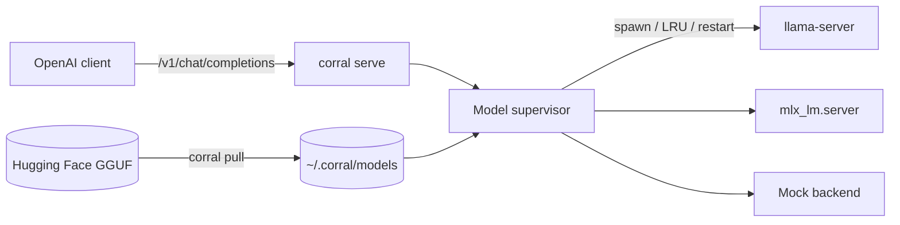

# Corral

[English](README.md) | [中文](README.zh.md) | [日本語](README.ja.md)

[](LICENSE) [](CHANGELOG.md) [](https://nodejs.org)  [](CONTRIBUTING.md)

**开源、零 fork 的本地模型运行器：驱动你自己安装的 llama.cpp 与 MLX，对外提供 OpenAI 兼容 API。**


```bash
git clone https://github.com/JaydenCJ/corral.git && cd corral && npm install && npm run build && npm link
```

> **预发布：** Corral 尚未发布到 npm。首个版本发布前，请克隆 [JaydenCJ/corral](https://github.com/JaydenCJ/corral) 并在仓库根目录执行 `npm install && npm run build && npm link`。

## 为什么是 Corral？

如今跑本地模型，往往只能二选一：要么用一个内置了私有 llama.cpp fork、还自带私有 registry 的顺手工具，要么自己手工拼装 `llama-server` 与 `llama-swap`。Corral 走中间路线——一个薄薄的编排层，启动你亲手安装的上游二进制、从 Hugging Face 拉取纯 GGUF 文件、说 OpenAI 的话，同时不 fork 任何东西、也不发明 registry。

|  | Corral | Ollama | llama.cpp + llama-swap |
|---|---|---|---|
| Forks / vendors llama.cpp | No (runs your binary) | Yes (vendored fork) | No (is llama.cpp) |
| Model source | Any Hugging Face GGUF | Ollama registry | Any GGUF (manual) |
| Hot model swapping | Yes | Yes | Yes (via llama-swap) |
| OpenAI-compatible API | Yes | Yes | Yes |
| Backends | llama.cpp + MLX | Bundled fork | llama.cpp |
| Single integrated tool | Yes | Yes | No (assemble yourself) |

## Corral 的立场

Corral 逐条回应社区对封闭本地模型工具的长期不满：

- **不 fork llama.cpp** —— Corral 启动的是你自己装好的 `llama-server` 二进制。没有会逐渐过时的补丁版副本；你更新 llama.cpp 的那一刻，上游修复就到你手里。
- **不搞私有 registry** —— 模型就是你磁盘上的那个 GGUF 文件。`corral pull` 直接从 Hugging Face 取回，并把来源 URL 写进 manifest。没有任何 `corral.com` 要中转。
- **改进上游化** —— Corral 有意只管编排（拉取、热切换、代理、进程监督）。凡是与推理相关的，都归 llama.cpp 或 MLX，让所有人受益。
- **模型格式不上锁** —— 你的文件始终是标准 GGUF。明天删掉 Corral，同一批文件照样能被任意 llama.cpp 构建加载。

## 特性

- **零 fork、不锁定** —— 运行你亲手安装的上游 `llama-server`；你的 GGUF 始终是你完全掌控的普通文件。
- **直接从 Hugging Face 拉取** —— `corral pull owner/repo:Q4_K_M` 解析文件清单、按 quant 选文件、断点续传。
- **模型热切换** —— 一个端点服务多个模型；Corral 按需启动对应后端，其余按 LRU 回收。
- **OpenAI 兼容 API** —— `/v1/chat/completions`、`/v1/completions`、`/v1/models`，SSE 流式原样透传。
- **双后端** —— llama.cpp 全平台、MLX 用于 Apple Silicon，可通过配置或 `--backend` 参数按服务选择。
- **自愈** —— 后端崩溃在有限次数内自动重启、空闲模型自动回收、Ctrl+C 清理每一个子进程。

## 快速开始

安装：

```bash
git clone https://github.com/JaydenCJ/corral.git && cd corral && npm install && npm run build && npm link
```

跑个 demo —— 确定性的 `mock` 后端不需要 llama.cpp、也不需要权重：

```bash
corral serve --backend mock --port 11435 &
curl -s localhost:11435/v1/chat/completions \
  -d '{"model":"demo","messages":[{"role":"user","content":"say hi"}]}'
```

输出：

```text
{"id":"chatcmpl-mock-demo","object":"chat.completion","created":1700000000,"model":"demo","choices":[{"index":0,"message":{"role":"assistant","content":"[demo] echo: say hi"},"finish_reason":"stop"}],"usage":{"prompt_tokens":8,"completion_tokens":19,"total_tokens":27}}
```

`mock` 后端端到端验证了整条链路。要跑真实推理，按下面接入你自己的模型。

## 使用你自己的模型

真实推理需要本机装有上游后端——Corral 不含任何模型、也不含任何引擎。以下步骤需要本地 llama.cpp（macOS/Linux）与网络访问，因此不属于上面容器内实测过的 Quickstart。

```bash
# 1. install upstream llama.cpp yourself (Corral vendors nothing)
brew install llama.cpp

# 2. pull a GGUF straight from Hugging Face into ~/.corral/models
corral pull TheBloke/Qwen2.5-7B-Instruct-GGUF:Q4_K_M

# 3. serve with the real backend and talk to it from any OpenAI client
corral serve --backend llamacpp
```

默认配置在 `~/.corral/config.json`，每条命令都能用参数覆盖：

```json
{
  "backend": "llamacpp",
  "host": "127.0.0.1",
  "port": 11435,
  "maxLoaded": 1,
  "idleTimeoutMs": 300000,
  "ctxSize": 4096,
  "maxRestarts": 3
}
```

在 Apple Silicon 上把 `"backend"` 设为 `"mlx"`（需 `pip install mlx-lm`）即可改跑 MLX 模型。把任意 OpenAI SDK 指向 `http://127.0.0.1:11435/v1`；切换模型只需改 `model` 字段。

## 验证

本仓库不设 CI；以上说明均以本地实跑验证。克隆本仓库即可复现：

```bash
npm ci && npm run build && npm test && bash scripts/smoke.sh
```

输出（拷贝自一次真实运行，用 `...` 截断）：

```text
 Test Files  9 passed (9)
      Tests  58 passed (58)
...
[smoke] GET /v1/models -> lists loaded mock model smoke-b
[smoke] POST /v1/chat/completions (stream) -> SSE chunks + [DONE]
SMOKE OK
```

## 架构



## 路线图

- [x] llama.cpp + MLX 后端、Hugging Face 拉取、热切换、OpenAI API、基于 mock 的测试
- [ ] 分片（多部分）GGUF 合并
- [ ] 配置里按模型覆盖后端与 quant
- [ ] 对照 Hugging Face 公布的哈希做可选 sha256 校验
- [ ] `corral serve` 的 Prometheus 指标端点
- [ ] 后端二进制的一等 Windows 支持

完整列表见 [open issues](https://github.com/JaydenCJ/corral/issues)。

## 参与贡献

欢迎贡献——从 [good first issue](https://github.com/JaydenCJ/corral/issues?q=is%3Aissue+is%3Aopen+label%3A%22good+first+issue%22) 入手，或到 [Discussions](https://github.com/JaydenCJ/corral/discussions) 发起讨论。

## 许可证

[MIT](LICENSE)
